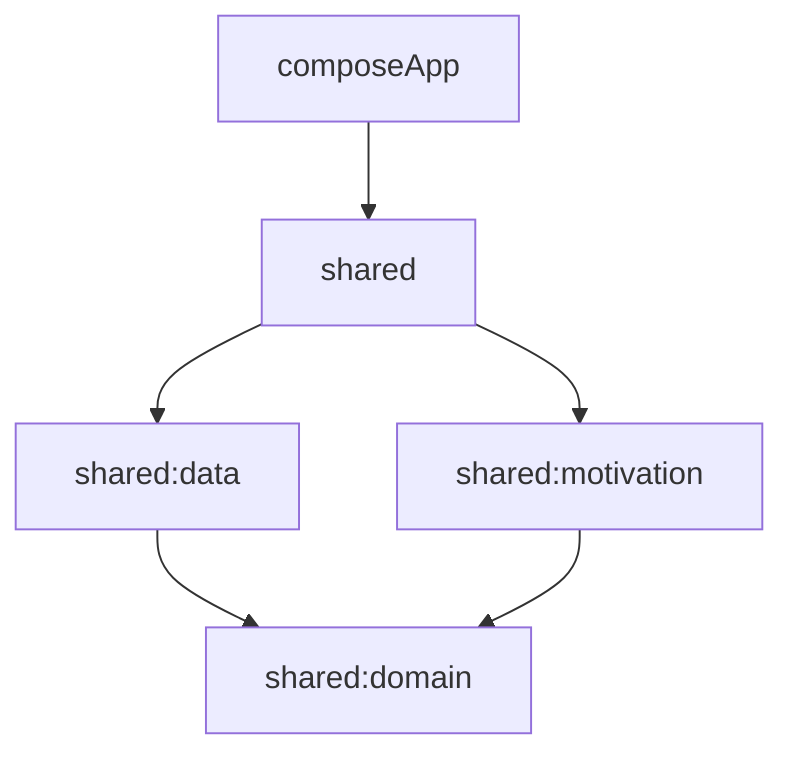

# Architecture: NoZero

## 1. Core Principles
- **Clean Architecture**: Decoupled layers (Domain, Data, Presentation) to ensure platform-independence and testability.
- **Local-First**: Offline storage as the single source of truth, ready for future cloud sync.

## 2. Module Separation
- **`shared:domain`**: Pure Kotlin. Zero dependencies. Contains business logic (Use Cases, Models, Repository Interfaces).
- **`shared:data`**: Implements Repository interfaces. Handles SQLDelight persistence and data mapping.
- **`shared:motivation`**: Specialized logic for identity-based reinforcement and milestone detection.
- **`composeApp`**: UI layer using Compose Multiplatform. Manages state and navigation.

## 3. Folder Structure
```text
root/
├── shared/                       # Multiplatform logic
│   ├── src/commonMain/kotlin/
│   │   ├── core/                 # DI, Base Utilities
│   │   ├── domain/               # Business Rules
│   │   ├── data/                 # Persistence Implementation
│   │   └── motivation/           # Motivation Engine
├── composeApp/                   # UI Layer
│   ├── src/commonMain/kotlin/
│   │   ├── ui/                   # Screens & Components
│   │   └── navigation/           # Nav Graph
```

## 4. Dependency Graph

